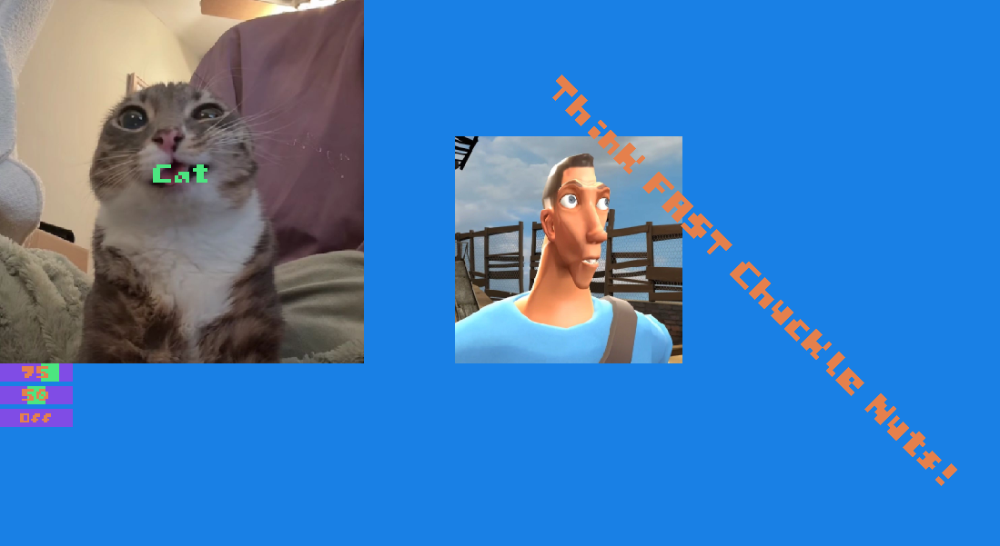

# **UXX**:
### Current Version: 0

## **Introduction:**
UXX is a library made for C++ to create good looking UI for your C++ applications.
Most modern UI libraries are either too complex, too old, performance tanking or 
made for other purposes (like ImGui for game engines).

UXX aims to provide a simple and intuitive API for creating UI for your C++ app and games.
It is designed to be easy to use and understand, while still providing powerful features.

I personally decided to make this project mainly because I found a roadblock when it came
to making good UI for my OpenGL game. I also wanted to learn more about C++ and graphics 
programming, and I think that this is a good project to work on.


## **Documentation:**
Here are the Documentation to UXX API:


## **Support:**
If you want to support this project, you are welcome to buy my game/s of steam
or support my YouTube channel by Subscribing as well:
 - My Steam Game: https://store.steampowered.com/app/3963720/SandBlocks/
 - My YouTube Channel: https://www.youtube.com/@ShizzyDa_Glizzy


## **Windows/Context/Input/Event UXX Supports (So Far):**
- **GLFW:** yes (I will be supporting GLFW for a bit before working support for SDL2/3, SFML, and others)
- **SDL2:** No
- **SDL3:** No (If I don't have SDL2 supported what makes you think I supported the third one) 
- **SFML:** No


## **Examples from Code to Picture:**

### **Wacky UI (Scroll down for proper UI):**
``` c++
UXX::BeginPanel(Rect(0, 0, 1920, 1080, 0), Color(0.1f, 0.5f, 0.9f, 1.0f));

Color normalColor = Color(1.0f, 1.0f, 1.0f, 1.0f);
Color hoveredColor = Color(0.5f, 0.5f, 0.5f, 1.0f);
Color clickedColor = Color(0.0f, 0.0f, 0.0f, 1.0f);

Color color1 = Color(0.3f, 0.9f, 0.5f, 1.0f);
Color color2 = Color(0.5f, 0.3f, 0.9f, 1.0f);
Color color3 = Color(0.9f, 0.5f, 0.3f, 1.0f);

std::string scoutImagePath("../Images/scout.jpg");
std::string catImagePath("../Images/cat.jpg");
std::string fontPath("../Fonts/sandypixels_5x5_font2.ttf");

static int intSliderValue = 75;
static float floatSliderValue = 50.0f;
static bool boolSwitchValue = false;

if (UXX::Button(Rect(0, 0, 400, 400, 0), normalColor, hoveredColor, clickedColor, color1, 2.0f, "Cat", catImagePath, fontPath))
    std::cout << "Cat" << "\n";

UXX::Image(Rect(500, 150, 250, 250, 0), Color(1.0f, 1.0f, 1.0f, 1.0f), scoutImagePath);

UXX::IntSlider(Rect(0, 400, 80, 20, 0), color2, color1, intSliderValue, 1, 100, 1);
UXX::FloatSlider(Rect(0, 425, 80, 20, 0), color2, color1, floatSliderValue, 1.0f, 100.0f);
UXX::Switch(Rect(0, 450, 80, 20, 0), color1, color2, color3, boolSwitchValue, 1.0f, "On", "Off", fontPath);

UXX::Text(Rect(600, 100, 80, 60, -45), color1, 2.5f, "Think FAST Chuckle Nuts!", fontPath);

UXX::EndPanel();
```
All that code created this masterpeice below VVV


### **General UI:**

### **Another General UI:**

### **A more advanced UI:**
