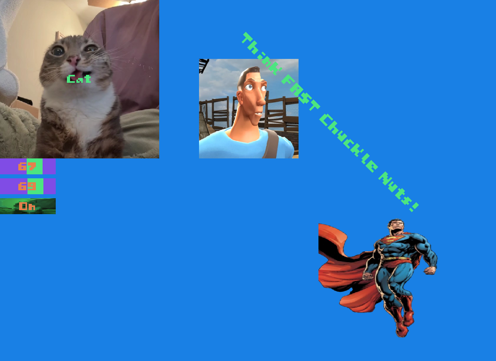

# **UXX**:
### Current Version: 0

## **Introduction:**
UXX is a library made for C++ to create good looking UI for your C++ applications.
Most modern UI libraries are either too complex, too old, performance tanking or 
made for other purposes (like ImGui for game engines).

UXX aims to provide a simple and intuitive API for creating UI for your C++ app and games.
It is designed to be easy to use and understand, while still providing powerful features.

I personally decided to make this project mainly because I found a roadblock when it came
to making good UI for my OpenGL game. I also wanted to learn more about C++ and graphics 
programming, and I think that this is a good project to work on.


## **Documentation:**
Documentation to UXX API:
The UXX functions follow a pretty basic and easy to follow. UXX is heavly inspired by the ImGui. So if you come from a background that works with things like game engines or in-general debugging for 2D/3D scenes that require the use of ImGui, then using UXX will have the same simple and easy to use learning curve. Here are the in-order parametrs that are followed in most of the function for UI creation:    
- Rect (X and Y Axis, Width and Height, and Rotation of Rectangle)
- Color/s + Parameter/s (Color/s and Parameter/s are mostly swapped around from time to time but for the most part it will be Parameter/s first then Color/s. Parameter/s can accpet your variables such (e.g. int, float, bool) that the widget reads, if the user interacts with the UI (e.g Buttons, Sliders, Switches) it will write back) 
- Text Color 
- Text Size 
- Text (What ever string of text you want to add on top of the UI Widget. Some will ask for two like the switch for ON/OFF)
- Image path (Path to what ever directory your image is in)
- Font path (Path to what ever directory your font is in)

Starting off, to create UI you must first 

## **Support:**
If you want to support this project, you are welcome to buy my game/s of steam
or support my YouTube channel by Subscribing as well:
 - My Steam Game: https://store.steampowered.com/app/3963720/SandBlocks/
 - My YouTube Channel: https://www.youtube.com/@ShizzyDa_Glizzy


## **Windows/Context/Input/Event UXX Supports (So Far):**
- **GLFW:** yes (I will be supporting GLFW for a bit before working support for SDL2/3, SFML, and others)
- **SDL2:** No
- **SDL3:** No (If I don't have SDL2 supported what makes you think I supported the third one) 
- **SFML:** No


## **Examples (Code to Picture):**

### **Wacky UI (Scroll down for proper UI):**
``` c++
UXX::BeginPanel(Rect(0, 0, 1920, 1080, 0), Color(0.1f, 0.5f, 0.9f, 1.0f));

Color normalColor = Color(1.0f, 1.0f, 1.0f, 1.0f);
Color hoveredColor = Color(0.5f, 0.5f, 0.5f, 1.0f);
Color clickedColor = Color(0.0f, 0.0f, 0.0f, 1.0f);

Color color1 = Color(0.3f, 0.9f, 0.5f, 1.0f);
Color color2 = Color(0.5f, 0.3f, 0.9f, 1.0f);
Color color3 = Color(0.9f, 0.5f, 0.3f, 1.0f);

std::string scoutImagePath("../UXXAssets/Images/scout.jpg");
std::string catImagePath("../UXXAssets/Images/cat.jpg");
std::string supermanImagePath("../UXXAssets/Images/transparent_image.png");
std::string fontPath("../UXXAssets/Fonts/sandypixels_5x5_font2.ttf");

static int intSliderValue = 75;
static float floatSliderValue = 50.0f;
static bool boolSwitchValue = false;

if (UXX::Button(Rect(0, 0, 400, 400, 0), normalColor, hoveredColor, clickedColor, color1, 2.0f, "Cat", catImagePath, fontPath))
    std::cout << "Cat" << "\n";

UXX::Image(Rect(500, 150, 250, 250, 0), Color(1.0f, 1.0f, 1.0f, 1.0f), scoutImagePath);
UXX::Image(Rect(800, 550, 250, 250, 0), Color(1.0f, 1.0f, 1.0f, 1.0f), supermanImagePath);

UXX::IntSlider(Rect(0, 400, 140, 40, 0), intSliderValue, 1, 100, 1, color2, color1, color3, 2, std::to_string(intSliderValue), "", fontPath);
UXX::FloatSlider(Rect(0, 450, 140, 40, 0), floatSliderValue, 1.0f, 100.0f, 1.0f, color2, color1, color3, 2, std::to_string((int)floatSliderValue), "", fontPath);
UXX::Switch(Rect(0, 500, 140, 40, 0), boolSwitchValue, color1, color2, color3, 2, "On", "Off", catImagePath, scoutImagePath, fontPath); catImagePath, scoutImagePath, fontPath);

UXX::Text(Rect(600, 100, 80, 60, -45), color1, 2.5f, "Think FAST Chuckle Nuts!", fontPath);

UXX::EndPanel();
```
All that code created this masterpeice under   VVV


### **General UI:**

### **Another General UI:**

### **A more advanced UI:**
