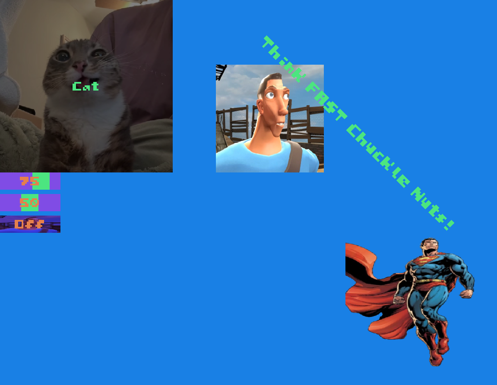

# **UXX**:
### Current Version: 1

## **Introduction:**
UXX is a library made for C++ to create good looking UI for your C++ applications.
Most modern UI libraries are either too complex, too old, performance tanking or 
made for other purposes (like ImGui for game engines).

UXX aims to provide a simple and intuitive API for creating UI for your C++ app and games.
It is designed to be easy to use and understand, while still providing powerful features.

I personally decided to make this project mainly because I found a roadblock when it came
to making good UI for my OpenGL game. I also wanted to learn more about C++ and graphics 
programming, and I think that this is a good project to work on.


## **Documentation:**
Documentation to UXX API:
The UXX functions follow a pretty basic and easy to follow. UXX is inspired by the ImGui c++ library and a little bit of CSS styling language. So if you come from a background that works with things like game engines, in-general debugging for 2D/3D scenes that require the use of ImGui, front-end web devlopment, then using UXX will have the same simple and easy to use learning curve. However, UXX is soo simple to use that even without a background in any of those things mentioned above, you could still understand and maybe even create an awesome game UI, app
and much more!

Starting off, to create UI you must first do a quick small init before starting work on it:
``` c++
UXXBackendGLFW uxxBackendGLFW;
if (!uxxBackendGLFW.init()) return 1; 
```
Then incompass the UI code in a lambda:
``` cpp
uxxBackendGLFW.run([&]()
{

    ... UI Code Here ...
    
});
```

Finally you can use these functions I have explaned below to get started using UXX in your C++ code-base:
``` c++
// The Begin and End panle are the core funtions needed to start making UI with UXX. Panels can also be used inside each other for more UI expression. You will need to type the x&y axis, width&height, and rotation of the panel for it to show up on screen. Additionally you could also add a color and or an image of choice. 
UXX::BeginPanel(Rect(x, y, width, height, rot), Color(0, 0, 0, 1), "path/to/image");
UXX::EndPanel();

// Before adding a UI widget you will first need to create structs with the a premade styles. The Style Structs is pretty easy and only takes a few minutes to an hour depending on how well you want your UI to look. Style Structs can also be reused over and over across the UI code and if any changes are needed then all the UI widgets will get updated along side the Style Structs.
UXX::ButtonStyle beautifulButtonStyle
{
    .normalColor  = Color(1.0f, 1.0f, 1.0f, 1.0f),
    .hoveredColor = Color(0.5f, 0.5f, 0.5f, 1.0f),
    .clickedColor = Color(0.0f, 0.0f, 0.0f, 1.0f),
    .textColor    = Color(0.3f, 0.9f, 0.5f, 1.0f),
    .textSize     = 2.0f,
    .fontPath     = fontPath,
    .imagePath    = catImagePath
};
UXX::SliderStyle smoothSliderStyle
{
    .trackColor      = Color(0.5f, 0.3f, 0.9f, 1.0f),
    .handleColor     = Color(0.3f, 0.9f, 0.5f, 1.0f),
    .textColor       = Color(0.9f, 0.5f, 0.3f, 1.0f),
    .textSize        = 2.0f,
    .fontPath        = fontPath,
    .trackImagePath  = ballImagePath,
    .handleImagePath = batImagePath
};
UXX::SwitchStyle sassySwitchStyle
{
    .onColor      = Color(0.3f, 0.9f, 0.5f, 1.0f),
    .offColor     = Color(0.5f, 0.3f, 0.9f, 1.0f),
    .textColor    = Color(0.9f, 0.5f, 0.3f, 1.0f),
    .textSize     = 2.0f,
    .fontPath     = fontPath,
    .onImagePath  = catOnImagePath,
    .offImagePath = dogOffImagePath
};
UXX::TextStyle terrificTextStyle
{
    .color    = Color(0.3f, 0.9f, 0.5f, 1.0f),
    .size     = 2.5f,
    .fontPath = fontPath
};
UXX::ImageStyle increadableImageStyle { .imagePath = frutigerAeroImagePath };
UXX::ImageStyle iranoutofbrainmemoryImageStyle { .imagePath = cogWheelImagePath };


// ===[Widgets]===
if (UXX::Button(Rect(0, 0, 400, 400, 0), beautifulButtonStyle, "Cat"))
    std::cout << "Cat \n";

UXX::Image(Rect(500, 150, 250, 250, 0), increadableImageStyle);
UXX::Image(Rect(800, 550, 300, 300, 0), iranoutofbrainmemoryImageStyle);

UXX::IntSlider(Rect(0, 400, 400, 200, 0), intSliderValue, 1, 100, 1, smoothSliderStyle, std::to_string(intSliderValue));
UXX::FloatSlider(Rect(0, 600, 400, 200, 0), floatSliderValue, 1.0f, 100.0f, 1.0f, smoothSliderStyle, std::to_string((int)floatSliderValue));

UXX::Switch(Rect(0, 800, 400, 200, 0), boolSwitchValue, sassySwitchStyle, "I am turned On", "I am turned Off");

UXX::Text(Rect(600, 100, 80, 60, -45), terrificTextStyle, "Example Text");
```


## **Windows/Context/Input/Event libraries UXX Supports (So Far):**
- **GLFW:** Yes (I will be supporting GLFW for a bit before working support for SDL2/3, SFML, and others)
- **SDL2:** No
- **SDL3:** No (If I don't have SDL2 supported what makes you think I supported the third one) 
- **SFML:** No


## **Support Me:**
If you want to support this project, you are welcome to buy my game/s of steam
or support my YouTube channel by Subscribing and liking and sharing any of my videos:
 - My Steam Game: https://store.steampowered.com/app/3963720/SandBlocks/
 - My YouTube Channel: https://www.youtube.com/@ShizzyDa_Glizzy


## **Examples (Code to Picture):**

### **Wacky UI (Scroll down for proper UI):**
``` c++
UXX::BeginPanel(Rect(0, 0, 1920, 1080, 0), Color(0.1f, 0.5f, 0.9f, 1.0f), "");

std::string scoutImagePath("../UXXAssets/Images/scout.jpg");
std::string catImagePath("../UXXAssets/Images/cat.jpg");
std::string supermanImagePath("../UXXAssets/Images/transparent_image.png");
std::string electionsImagePath("../UXXAssets/Images/elections.jpg");
std::string hamImagePath("../UXXAssets/Images/hamster.png");
std::string fontPath("../UXXAssets/Fonts/sandypixels_5x5_font2.ttf");

static int intSliderValue = 75;
static float floatSliderValue = 50.0f;
static bool boolSwitchValue = false;

// ===[Styles]===
UXX::ButtonStyle catButtonStyle
{
    .normalColor  = Color(1.0f, 1.0f, 1.0f, 1.0f),
    .hoveredColor = Color(0.5f, 0.5f, 0.5f, 1.0f),
    .clickedColor = Color(0.0f, 0.0f, 0.0f, 1.0f),
    .textColor    = Color(0.3f, 0.9f, 0.5f, 1.0f),
    .textSize     = 2.0f,
    .fontPath     = fontPath,
    .imagePath    = catImagePath
};

UXX::SliderStyle imageSliderStyle
{
    .trackColor      = Color(0.5f, 0.3f, 0.9f, 1.0f),
    .handleColor     = Color(0.3f, 0.9f, 0.5f, 1.0f),
    .textColor       = Color(0.9f, 0.5f, 0.3f, 1.0f),
    .textSize        = 2.0f,
    .fontPath        = fontPath,
    .trackImagePath  = electionsImagePath,
    .handleImagePath = hamImagePath
};

UXX::SwitchStyle catSwitchStyle
{
    .onColor      = Color(0.3f, 0.9f, 0.5f, 1.0f),
    .offColor     = Color(0.5f, 0.3f, 0.9f, 1.0f),
    .textColor    = Color(0.9f, 0.5f, 0.3f, 1.0f),
    .textSize     = 2.0f,
    .fontPath     = fontPath,
    .onImagePath  = catImagePath,
    .offImagePath = scoutImagePath
};

UXX::TextStyle titleTextStyle
{
    .color    = Color(0.3f, 0.9f, 0.5f, 1.0f),
    .size     = 2.5f,
    .fontPath = fontPath
};

UXX::ImageStyle scoutImageStyle    { .imagePath = scoutImagePath };
UXX::ImageStyle supermanImageStyle { .imagePath = supermanImagePath };

// ===[Widgets]===
if (UXX::Button(Rect(0, 0, 400, 400, 0), catButtonStyle, "Cat"))
    std::cout << "Cat" << "\n";

UXX::Image(Rect(500, 150, 250, 250, 0), scoutImageStyle);
UXX::Image(Rect(800, 550, 300, 300, 0), supermanImageStyle);

UXX::IntSlider(Rect(0, 400, 400, 200, 0), intSliderValue, 1, 100, 1, imageSliderStyle, std::to_string(intSliderValue));
UXX::FloatSlider(Rect(0, 600, 400, 200, 0), floatSliderValue, 1.0f, 100.0f, 1.0f, imageSliderStyle, std::to_string((int)floatSliderValue));

UXX::Switch(Rect(0, 800, 400, 200, 0), boolSwitchValue, catSwitchStyle, "On", "Off");

UXX::Text(Rect(600, 100, 80, 60, -45), titleTextStyle, "Think FAST Chuckle Nuts!");

UXX::EndPanel();
```
All that code created this masterpeice under   VVV


### **General UI:**

### **Another General UI:**

### **A more advanced UI:**
